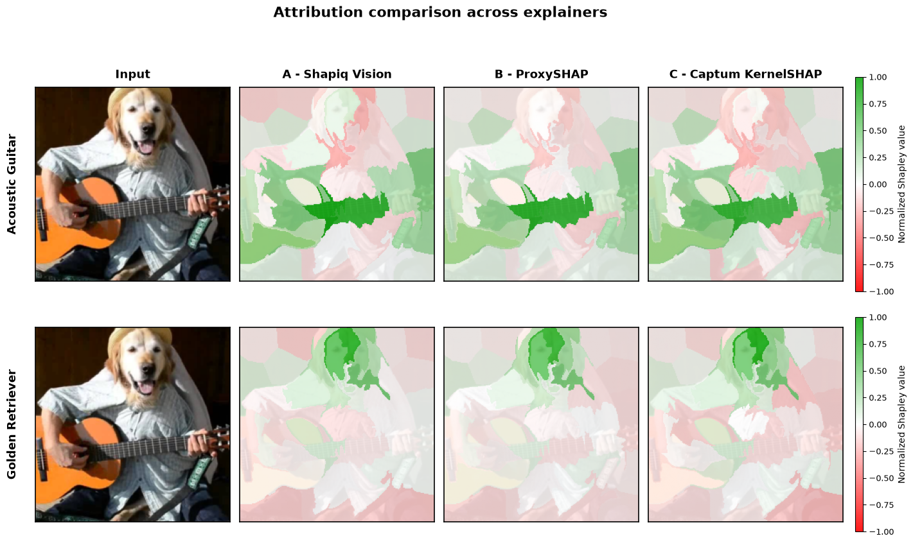
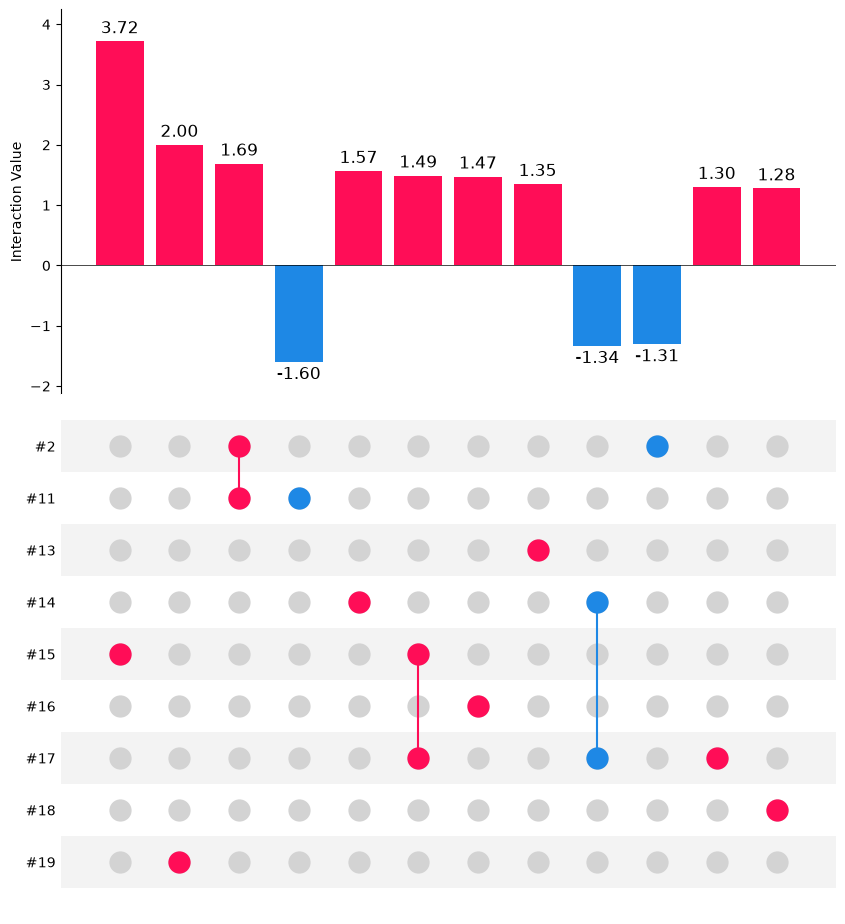
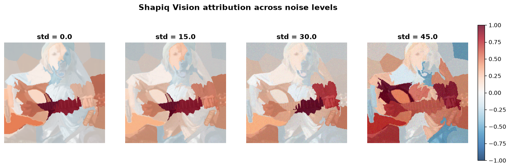
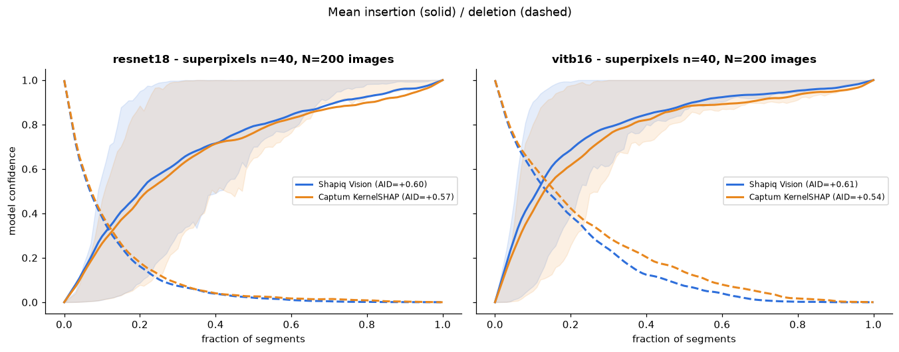
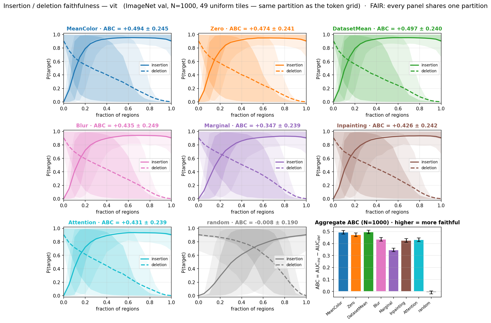

# XAI-Praktikum

This repository compares three Shapley-value attribution methods for image classification:

- **Shapiq Vision**
- **ProxySHAP**
- **Captum KernelSHAP**

The comparison is organized into five notebooks that progressively move from a single-image demonstration to robustness analysis and finally to large-scale quantitative benchmarks.

## Repository Overview

| Notebook | Purpose |
|----------|---------|
| `comparison_of_methods.ipynb` | Side-by-side comparison of all three methods on a single ImageNet image |
| `shapiq_vision_second_order.ipynb` | Second-order (pairwise) interaction values with Shapiq Vision, visualized as an upset plot |
| `shapiq_vision_noise_test.ipynb` | Analysis of attribution stability under increasing image noise |
| `faithfulness_AID_benchmark.ipynb` | Large-scale benchmark using the insertion/deletion AID faithfulness metric |
| `masking_faithfulness_benchmark.ipynb` | Which *masking strategy* yields the most faithful explanation, over 1000 images |

---

## Notebooks

### `comparison_of_methods.ipynb`

This notebook serves as the main introduction to the repository. It compares all three attribution methods on a single image using a ResNet-18 classifier.


The chosen image is an interesting stress test because it contains two valid semantic concepts-a **golden retriever** and a **guitar**. We explain two different model predictions: the top-1 prediction and the model's fifth-ranked class.

The notebook includes:

- an introduction to Shapley values,
- conceptual explanations of each attribution method,
- mathematical derivations of Kernel SHAP and ProxySHAP,
- side-by-side superpixel attribution heatmaps,
- bar plots showing the ten most important superpixels for each method,
- a comparison of runtime and model-call budgets.



---

### `shapiq_vision_second_order.ipynb`

The other notebooks only look at first-order Shapley values - one number per superpixel. This notebook asks Shapiq Vision for **second-order interactions** too: how much a *pair* of superpixels contributes jointly, beyond what their individual values would predict. Same model, image, and superpixel setup, just with `max_order=2` and the k-Shapley Interaction Index (`k-SII`) instead of ordinary first-order Shapley values.

The result is visualized with an **upset plot**: the top bars show the strongest individual interactions (both single superpixels and pairs), and the matrix underneath shows which superpixel(s) each bar corresponds to. A numbered superpixel reference image is shown alongside the plot so the labels are traceable back to actual image regions, and the number of interactions displayed is configurable.



---

### `shapiq_vision_noise_test.ipynb`

This notebook investigates the robustness of **Shapiq Vision** under image perturbations.

Starting from the exact setup used in the comparison notebook, Gaussian noise is added to the input image at several increasing noise levels while keeping the segmentation and model unchanged. The resulting attributions are then compared with those obtained from the clean image.

The notebook provides:

- attribution heatmaps for each noise level,
- a qualitative analysis of how explanations change as the image becomes increasingly noisy.



Although the focus is on Shapiq Vision, the experiment also illustrates how the underlying **ResNet-18** model behaves under severe image corruption and how attribution methods can help identify where the model begins to fail. From this analysis, we can see that ResNet-18 struggles with high levels of noise, which is also supported by previous works such as [*"The Role of Noisy Data in Improving CNN Robustness for Image Classification"*](https://arxiv.org/abs/2601.08043) and [*"Effects of Degradations on Deep Neural Network Architectures"*](https://arxiv.org/html/1807.10108v6).

---

### `faithfulness_AID_benchmark.ipynb`

This notebook extends the comparison from a single example to a quantitative benchmark over approximately **200 ImageNet images**.

Faithfulness is evaluated using the **Area between Insertion and Deletion (AID)** metric, where higher values indicate explanations that better capture the model's decision process.

The current benchmark compares:

- **Shapiq Vision**
- **Captum KernelSHAP**

across

- two segmentation strategies (superpixels and regular grids), and
- two image classification models (ResNet-18 and ViT-B/16).

The notebook is organized into two sections:

### 1. Experiment

Runs the complete benchmark (disabled by default via `RUN_EXPERIMENT = False`).

Results are stored in `aid_sweep_results.pkl`, allowing interrupted runs to resume automatically. Setting `PILOT = True` executes the benchmark on only a small subset of images for quick testing.

### 2. Results

Loads the stored benchmark results and produces:

- insertion and deletion curves,
- per-image AID agreement scatter plots,
- mean AID comparisons across segmentation strategies,
- summary tables,

with all figures shown separately for ResNet-18 and ViT-B/16.


> **Note on the committed results.** `data/aid_sweep_results.pkl` and the figure above were produced by an earlier revision of the experiment section, running against an earlier version of the shapiq fork. The notebook has since been updated to the current API, and some implementation details changed with it. The experimental design is unchanged, and a rerun is expected to reproduce the same conclusion.

---

### `masking_faithfulness_benchmark.ipynb`

The other notebooks ask *which attribution method* is best. This one asks a different question: **which masking strategy** - that is, which definition of "this region is removed" - produces the most faithful explanation.

Every explanation needs a removal rule, and `shapiq.vision` offers several. The notebook benchmarks six of them (`MeanColorMasking`, `ZeroMasking`, `DatasetMeanMasking`, `BlurMasking`, `MarginalSampling`, `InpaintingMasking`) plus ViT's token-space removal, over **1000 ImageNet images per run**, scoring each with insertion/deletion ABC. A random attribution order is included as a floor and lands at 0.00 ± 0.01, confirming the metric measures what it claims to.

It runs three configurations:

| Run | Model | Partition |
|-----|-------|-----------|
| `resnet50` | ResNet-50 | 25 SLIC superpixels |
| `vit` | ViT-B/16 | 25 SLIC superpixels |
| `vit_grid49` | ViT-B/16 | 49 uniform tiles |

The third run exists to make one comparison honest. Token masking **cannot** use superpixels - `PatchStrategy` has to tile ViT's 14×14 token grid - so comparing it against superpixel-based strategies confounds the *removal rule* with the *partition*. Because `GridStrategy(grid_shape=7)` is geometrically identical to `PatchStrategy(grid_size=14, n_players=49)`, the `vit_grid49` run holds the partition fixed and lets the removal rule vary alone.



The headline result is that this distinction matters. Token masking appears to trail the best pixel strategy by **-0.163 ABC**, but a paired decomposition attributes **-0.100 to the partition** and only **-0.063 to the removal rule**: on an equal footing, token masking is mid-pack rather than last. Elsewhere, the cheap constant fills (`DatasetMeanMasking`, `MeanColorMasking`) top every run, while the expensive strategies do not pay for themselves - and `MarginalSampling` is strikingly partition-sensitive, competitive on superpixels but worst on a uniform grid.

The notebook is self-contained, checkpoints every 25 images, and resumes automatically (`RESUME = True`); `PILOT = True` runs a small subset for a quick check. A full run takes roughly five hours on a GPU. Results are stored in `data/faithfulness_results.json` and `data/faithfulness_results.npz`, so every figure can be rebuilt without recomputing.

---

## Installation

Install the required packages with:

```bash
pip install "git+https://github.com/S2k-1/shapiq.git@feature/pr_final" captum scikit-image xgboost --quiet
```

---

## Suggested Reading Order

1. `comparison_of_methods.ipynb` - Learn the intuition behind each attribution method and compare them on a single image.
2. `shapiq_vision_second_order.ipynb` - See how Shapiq Vision's explanations extend to pairwise superpixel interactions.
3. `shapiq_vision_noise_test.ipynb` - Explore how Shapiq Vision explanations behave under increasing image noise.
4. `faithfulness_AID_benchmark.ipynb` - Examine the large-scale quantitative comparison using the AID faithfulness metric.
5. `masking_faithfulness_benchmark.ipynb` - Turn the question around and ask which masking strategy makes an explanation faithful in the first place.
